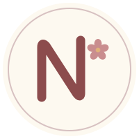

<div align="center">
  
  <h1>Nicole en Camino</h1>
  <p>Catálogo y wishlist para la llegada de un bebé.</p>
</div>

Una app para llevar el registro de **qué recibieron, de parte de quién y
dónde quedó guardado** durante todo el proceso de la llegada de un bebé.
Incluye una wishlist compartible para coordinar con la familia y evitar
regalos duplicados, preservando la sorpresa de quién regaló qué hasta que
el regalo llega.

## Cómo funciona

**Registrar lo que llega:** un botón anota "recibimos X de parte de Y" en
un solo paso — si el objeto no estaba en el catálogo se crea ahí mismo, y
el nombre de la persona se autocompleta con los que ya usaron para que no
queden variantes del mismo nombre. Se le puede sumar una foto de Nicole
usando el regalo, para mandársela después a quien lo dio.

**Agradecer sin olvidarse de nadie:** una vista agrupa todo lo que regaló
cada persona y marca a quién falta agradecer.

**Encontrar las cosas:** cada objeto lleva su etapa (recién nacido, 0-3
meses…) y su caja de almacenamiento. El buscador responde "¿dónde
guardamos el termómetro?" mostrando caja, etapa y quién lo regaló.

**Para los invitados:** entran con un link, sin crear cuenta, y marcan qué
van a regalar, con un mensaje opcional. De los items que se necesitan de a
varios (bodies, pañales) cada uno aparta una unidad y el resto sigue
disponible.

**La sorpresa:** cuando alguien reserva, su nombre y su mensaje quedan
guardados pero **nadie puede verlos — ni la pareja**. Se revelan recién al
marcar ese regalo como recibido, y de a uno: recibir una unidad no delata
a quienes reservaron las otras. Esto no es una regla de UI — el schema de
la API simplemente no expone esos campos, y hay tests que verifican que el
nombre no aparece en ningún byte de ninguna respuesta de admin.

## Stack

| Capa | Tecnología |
|---|---|
| Backend | FastAPI · SQLAlchemy 2.0 · Alembic · PostgreSQL 16 |
| Frontend | Nuxt 3 · TypeScript · Nuxt UI v2 · Pinia |
| Auth | JWT (PyJWT) · bcrypt |
| Fotos | Cloudflare R2 (S3-compatible, subida directa con presign) |
| Deploy | Railway (API) · Vercel (web) |

## Setup local

Requiere Docker, Python 3.13 y Node 22.

### 1. Base de datos

```bash
docker compose up -d
```

Levanta Postgres 16 en el puerto **5433** (no 5432, para no chocar con
otros proyectos).

### 2. Backend

```bash
cd backend && python -m venv .venv && .venv/Scripts/pip install -r requirements.txt
```

Copiá `.env.example` a `.env` y ajustá lo que necesites. Después aplicá
las migraciones y creá la cuenta admin:

```bash
.venv/Scripts/alembic upgrade head
```

```bash
ADMIN_EMAIL=vos@ejemplo.com ADMIN_PASSWORD=tu-clave-segura .venv/Scripts/python seed_admin.py
```

Arrancá la API:

```bash
.venv/Scripts/uvicorn main:app --reload
```

Queda en http://localhost:8000 — con Swagger en `/docs`.

### 3. Frontend

```bash
cd frontend && npm install && npm run dev
```

Queda en http://localhost:3000.

## Tests y calidad

```bash
cd backend && .venv/Scripts/python -m pytest --cov=app --cov=main
```

```bash
cd frontend && npx vitest run --coverage
```

También corren `ruff check .` y `ruff format --check .` en el backend, y
`npx eslint .` más `npx vue-tsc --noEmit` en el frontend. Todo esto se
valida en CI (GitHub Actions) en cada PR contra `main`, junto con la
convención de [Conventional Commits](https://www.conventionalcommits.org/).

Los commits se validan también localmente con un hook de husky, que se
instala solo al correr `npm install` en la raíz del repo.

## Fotos (Cloudflare R2)

Las fotos son opcionales: sin configurar R2 la app funciona completa y los
endpoints de foto responden 503 con un mensaje claro.

Para activarlas, creá un bucket en Cloudflare R2 y completá en el `.env`
del backend: `R2_ACCOUNT_ID`, `R2_ACCESS_KEY_ID`, `R2_SECRET_ACCESS_KEY`,
`R2_BUCKET` y `R2_PUBLIC_URL`. El backend solo firma URLs — el archivo
viaja directo del navegador a R2, restringido a jpeg/png/webp de hasta
5 MB.

## Deploy

### Backend en Railway

Railway detecta `backend/railway.json`, que corre `alembic upgrade head`
como pre-deploy. Variables de entorno necesarias:

| Variable | Notas |
|---|---|
| `DATABASE_URL` | La genera Railway al agregar Postgres |
| `JWT_SECRET` | 32+ caracteres. Generalo con `python -c "import secrets; print(secrets.token_hex(32))"` |
| `CORS_ORIGINS` | La URL del frontend en Vercel, sin barra final |
| `DEBUG` | `false` en producción (activa validaciones del secreto y oculta `/docs`) |
| `R2_*` | Solo si vas a usar fotos |

Después del primer deploy, corré el seed del admin una vez desde la
consola de Railway con `ADMIN_EMAIL` y `ADMIN_PASSWORD`.

### Frontend en Vercel

Root directory `frontend`, framework Nuxt (autodetectado). Configurá
`NUXT_PUBLIC_API_BASE` con la URL pública de la API en Railway.

## Documentación del diseño

El proyecto se construyó con spec-driven development, en tandas:

- [`001-baby-wishlist/`](specs/001-baby-wishlist/) — la app base.
- [`002-mejoras/`](specs/002-mejoras/) — cantidad, categorías, prioridad,
  precio, buscador, mensaje y PWA.
- [`003-registro-regalos/`](specs/003-registro-regalos/) — el registro de
  regalos, agradecimientos, etapas y las fotos de Nicole.
- [`004-pagina-publica/`](specs/004-pagina-publica/) — la página de
  celebración. **Pendiente**, solo las decisiones tomadas.

Cada tanda tiene los mismos tres documentos:

- [`spec.md`](specs/001-baby-wishlist/spec.md) — el qué y el por qué:
  historias de usuario y reglas de negocio.
- [`plan.md`](specs/001-baby-wishlist/plan.md) — el cómo: arquitectura,
  modelo de datos, endpoints, paleta y criterios de calidad.
- [`tasks.md`](specs/001-baby-wishlist/tasks.md) — el desglose en tareas,
  con su estado.
